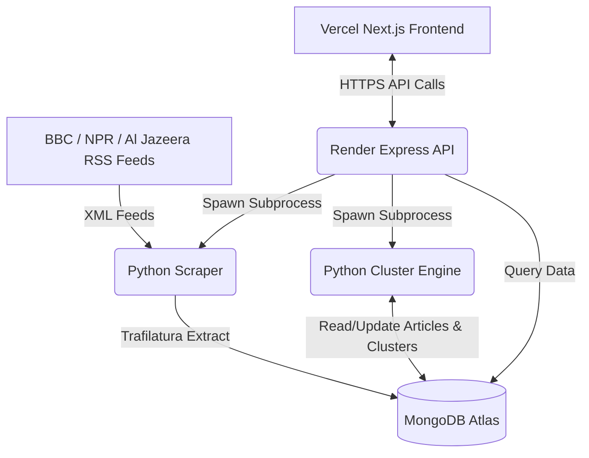

# News Pulse

News Pulse is a live topic wire and news aggregator that fetches, processes, clusters, and visualizes news from multiple global sources. It automatically groups related stories together in real-time to show timeline durations, news intensities, and source coverage.

- **GitHub Repository**: [https://github.com/rakshitbondwal/News-Pulse](https://github.com/rakshitbondwal/News-Pulse)
- **Live Frontend**: [https://news-pulse-dusky.vercel.app](https://news-pulse-dusky.vercel.app)
- **Live Backend API**: [https://news-pulse-backend-hslx.onrender.com](https://news-pulse-backend-hslx.onrender.com)

---

##  Repository Structure

The project is structured into three self-contained directories:

- [**/scraper**](https://github.com/rakshitbondwal/News-Pulse/tree/main/scraper) - Python scripts for RSS ingestion, keyword extraction, and story clustering.
- [**/backend**](https://github.com/rakshitbondwal/News-Pulse/tree/main/backend) - Node.js Express server exposing data API endpoints and triggering python ingestion.
- [**/frontend**](https://github.com/rakshitbondwal/News-Pulse/tree/main/frontend) - Next.js React dashboard using Recharts for timeline visualizations.

---

##  Architecture Overview



News Pulse uses a modern, decoupled architecture:
1. **Scraping Layer (Python)**: Fetches RSS feeds, downloads full article content, filters stop words, and groups articles using a keyword-overlap clustering algorithm.
2. **Database Layer (MongoDB Atlas)**: Stores raw scraped articles, unique URL hashes (to prevent duplicates), and generated story clusters.
3. **API Server Layer (Express / Node.js)**: Acts as the bridge. It handles database connections, serves endpoints to the frontend, and invokes the Python scraping/clustering subprocesses dynamically on demand.
4. **Client Interface (Next.js)**: Consumes the REST endpoints and renders an interactive timeline visualization showing when a topic was active, how many articles covered it, and the breakdown by source.

---

##  Topic-Grouping (Clustering) Approach

### Methodology
The clustering system (`scraper/cluster.py`) groups articles using a **custom keyword-overlap algorithm**:
1. **Keyword Extraction**: Cleans HTML/URLs and tokenizes article titles + summaries. It filters out English stopwords and news outlet terms (e.g., *BBC, Reuters, says, told*).
2. **Union-Find Disjoint Set**: Computes keyword overlaps between all pairs of articles.
3. **Thresholding**: If two articles share at least **4 unique keywords** (`OVERLAP_THRESHOLD = 4`), they are unioned into the same cluster.
4. **Label Generation**: The top 3 most common keywords across all cluster members are capitalized and joined to generate a human-readable title (e.g., *"France Elections Macron"*).

### Limitations
- **No Semantic Understanding**: Because it relies on exact string overlap, it cannot group articles using synonyms (e.g., mapping *"President"* to *"POTUS"*, or *"Car"* to *"Vehicle"*).
- **Hard Thresholding Sensitivity**: A fixed threshold of 4 words might miss connections in shorter summaries, or conversely, create massive, unrelated clusters ("spaghetti clustering") if two distinct topics share common high-frequency words.
- **Single-Linkage Chaining**: In union-find, if Article A connects to Article B, and B connects to C, A and C are placed in the same cluster even if they share zero keywords in common.
- **O(N²) Complexity**: Comparing every article pair pairwise does not scale to thousands of daily articles.

---

##  Supported News Sources

- **BBC News** (`http://feeds.bbci.co.uk/news/rss.xml`)
- **NPR** (`https://feeds.npr.org/1001/rss.xml`)
- **Al Jazeera** (`https://www.aljazeera.com/xml/rss/all.xml`)

---

##  API Endpoints Documentation

The Express server exposes the following JSON endpoints:

* **`GET /timeline`**
  - Builds and returns data for the main timeline chart.
  - *Response Schema*: `Array<{ id: string, label: string, start: ISOString, end: ISOString, count: number, intensity: number }>`

* **`GET /clusters`**
  - Returns a list of all identified story clusters.
  - *Response Schema*: `Array<{ id: string, label: string, article_count: number, start_time: ISOString, end_time: ISOString }>`

* **`GET /clusters/:id`**
  - Returns details of a specific cluster along with all its matching articles.
  - *Response Schema*: `{ id: string, label: string, article_count: number, start_time: ISOString, end_time: ISOString, articles: Array<{ id: string, title: string, source: string, url: string, published_at: ISOString, summary: string }> }`

* **`POST /ingest/trigger`**
  - Spawns a background job to run the Python scraper followed by the clustering script.
  - *Response Schema*: `{ jobId: string }`

* **`GET /ingest/status/:jobId`**
  - Gets the status of a triggered ingestion job.
  - *Response Schema*: `{ status: "running" | "completed" | "failed", error?: string }`

---

##  Local Setup & Configuration

### Prerequisites
- Node.js (v18+)
- Python (v3.9+)
- A MongoDB cluster (Atlas or local)

### 1. Database Setup
Ensure you have a MongoDB instance running and get your connection string.

### 2. Scraper Configuration
1. Navigate to `/scraper` and create a python virtual environment:
   ```bash
   cd scraper
   python -m venv venv
   # Activate venv:
   # On Windows: venv\Scripts\activate
   # On Unix/Mac: source venv/bin/activate
   ```
2. Install dependencies:
   ```bash
   pip install -r requirements.txt
   ```
3. Create a `.env` file in the `/scraper` directory:
   ```env
   MONGO_URI=your_mongodb_connection_string
   ```

### 3. Backend Setup
1. Navigate to `/backend` and install dependencies:
   ```bash
   cd ../backend
   npm install
   ```
2. Create a `.env` file in the `/backend` directory:
   ```env
   MONGO_URI=your_mongodb_connection_string
   PORT=5000
   ```
3. Start the API server:
   ```bash
   npm start
   ```

### 4. Frontend Setup
1. Navigate to `/frontend` and install dependencies:
   ```bash
   cd ../frontend
   npm install
   ```
2. Create a `.env` or `.env.local` file in the `/frontend` directory:
   ```env
   NEXT_PUBLIC_API_URL=http://localhost:5000
   ```
3. Start the development server:
   ```bash
   npm run dev
   ```
4. Open [http://localhost:3000](http://localhost:3000) in your browser.
